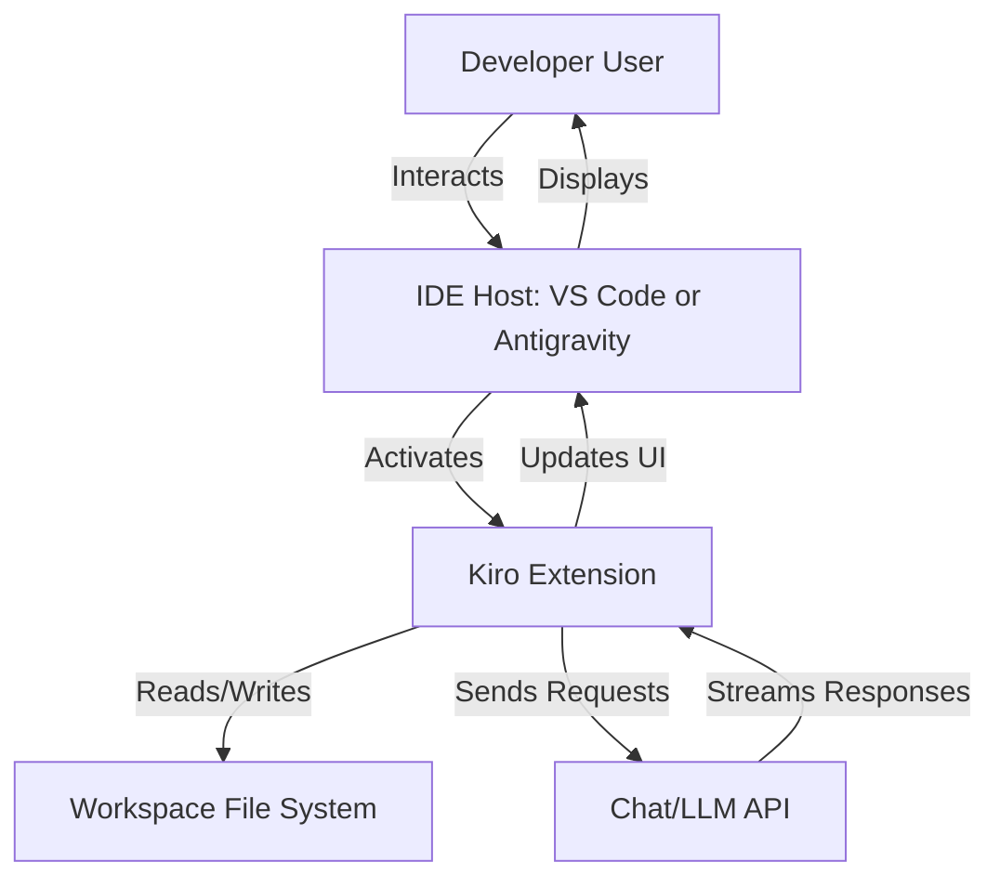
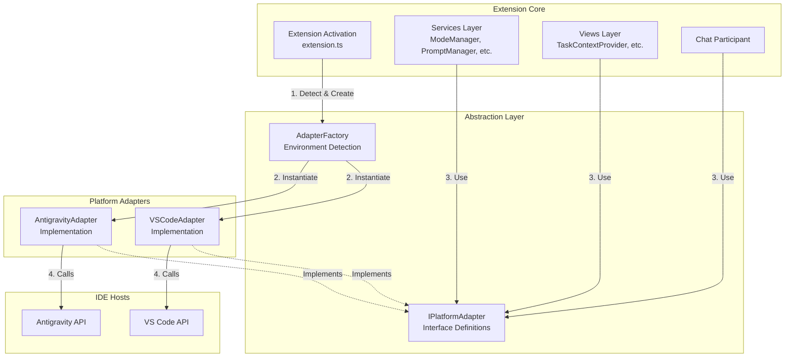
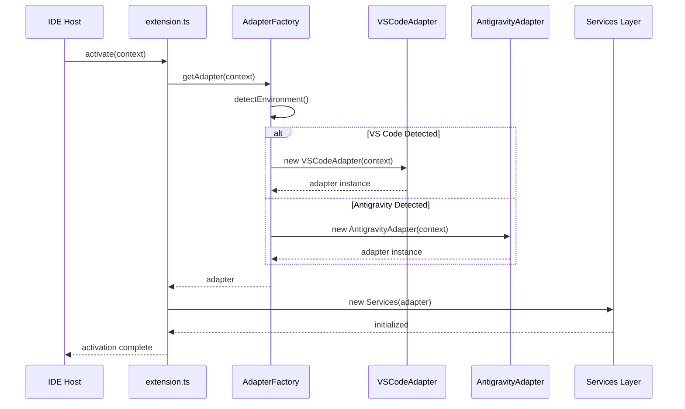
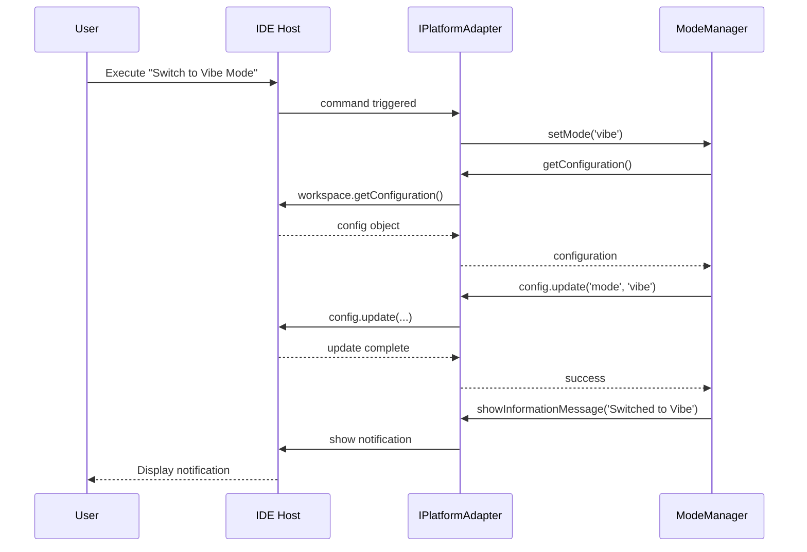

# Technical Design: Antigravity Input Support

## Document Information

- **Feature Name**: Antigravity Input Support
- **Version**: 1.0
- **Date**: November 25, 2025
- **Author**: Kiro AI Assistant
- **Reviewers**: Development Team
- **Related Documents**: [requirements.md](./requirements.md)

## Overview

This design implements a platform abstraction layer using the **Adapter Pattern** to enable the Kiro extension to run seamlessly in both VS Code and Antigravity IDE. The core strategy is to introduce TypeScript interfaces that mirror the VS Code extension API surface, then create concrete adapter implementations for each platform. Existing services (`ModeManager`, `PromptManager`, `ChatParticipant`, etc.) will be refactored to depend on these interfaces rather than directly importing the `vscode` module, enabling dependency injection of the appropriate adapter at extension activation.

### Design Goals
- **Zero Regression**: Existing VS Code functionality remains 100% intact and performant
- **Single Codebase**: No code duplication; platform differences handled via adapters
- **Easy Extension**: Adding new platform support requires only implementing adapter interfaces
- **Type Safety**: Full TypeScript type checking across all platform abstractions

### Key Design Decisions

| Decision | Rationale |
|----------|-----------|
| **Adapter Pattern over Preprocessor Directives** | Maintains clean, testable code without conditional compilation; easier to understand and maintain |
| **Interface-First Design** | Mirrors VS Code API structure closely to minimize refactoring of existing services |
| **Factory-Based Adapter Selection** | Centralizes environment detection and adapter instantiation in one location |
| **Lazy Initialization** | Adapters instantiate platform-specific resources only when needed, improving startup time |
| **Graceful Degradation** | Features unavailable on a platform return clear errors rather than crashing |

## Architecture

### System Context

The extension operates entirely within an IDE host (VS Code or Antigravity). It does not communicate with external services beyond what the IDE provides (e.g., GitHub Copilot API via the host).



### High-Level Architecture



### Technology Stack

| Layer | Technology | Rationale |
|-------|------------|-----------|
| Language | TypeScript 5.x | Strong typing, interface support, existing codebase |
| Runtime | Node.js 18+ | Required by both VS Code and Antigravity |
| Build System | tsc (TypeScript Compiler) | Existing build pipeline |
| Extension API | VS Code Extension API + Antigravity Extension API | Platform-specific endpoints |
| Testing | VS Code Extension Test Runner + Manual Testing | Existing test infrastructure |

## Components and Interfaces

### Component 1: IPlatformAdapter (Core Interface)

**Purpose**: Defines the complete contract for all platform-specific operations, serving as the primary abstraction boundary.

**Responsibilities**:
- Define methods for input/output operations
- Define methods for UI component creation and management
- Define methods for configuration access
- Define methods for file system operations
- Define methods for command registration
- Define methods for chat participant registration

**Interface Definition**:
```typescript
/**
 * Core platform adapter interface that all IDE adapters must implement.
 * Provides a unified API surface for extension services to interact with the host IDE.
 */
export interface IPlatformAdapter {
    // Environment metadata
    readonly platformName: 'vscode' | 'antigravity' | 'unknown';
    readonly version: string;
    
    // Input/Output
    showInformationMessage(message: string, ...items: string[]): Promise<string | undefined>;
    showWarningMessage(message: string, ...items: string[]): Promise<string | undefined>;
    showErrorMessage(message: string, ...items: string[]): Promise<string | undefined>;
    showInputBox(options: InputBoxOptions): Promise<string | undefined>;
    showQuickPick<T extends QuickPickItem>(items: T[], options: QuickPickOptions): Promise<T | undefined>;
    
    // UI Components
    createTreeDataProvider<T>(viewId: string, provider: TreeDataProvider<T>): Disposable;
    createStatusBarItem(alignment?: StatusBarAlignment, priority?: number): StatusBarItem;
    
    // Configuration
    getConfiguration(section?: string): Configuration;
    
    // File System
    readFile(uri: Uri): Promise<Uint8Array>;
    writeFile(uri: Uri, content: Uint8Array): Promise<void>;
    stat(uri: Uri): Promise<FileStat>;
    readDirectory(uri: Uri): Promise<[string, FileType][]>;
    createDirectory(uri: Uri): Promise<void>;
    delete(uri: Uri, options?: { recursive?: boolean }): Promise<void>;
    
    // Workspace
    getWorkspaceFolders(): WorkspaceFolder[] | undefined;
    getActiveTextEditor(): TextEditor | undefined;
    onDidChangeActiveTextEditor(listener: (editor: TextEditor | undefined) => void): Disposable;
    onDidChangeConfiguration(listener: (event: ConfigurationChangeEvent) => void): Disposable;
    createFileSystemWatcher(globPattern: string): FileSystemWatcher;
    
    // Commands
    registerCommand(command: string, callback: (...args: any[]) => any): Disposable;
    executeCommand<T = any>(command: string, ...args: any[]): Promise<T>;
    
    // Chat
    createChatParticipant(id: string, handler: ChatRequestHandler): ChatParticipant;
    
    // Clipboard
    writeToClipboard(text: string): Promise<void>;
    
    // Context
    getExtensionContext(): ExtensionContext;
}
```

**Implementation Notes**:
- All methods return promises for async operations, maintaining consistency
- Types like `Uri`, `Disposable`, `QuickPickItem` will be defined as platform-agnostic interfaces
- The adapter implementation handles mapping these types to platform-specific equivalents

---

### Component 2: AdapterFactory

**Purpose**: Detects the runtime environment and instantiates the appropriate platform adapter.

**Responsibilities**:
- Detect whether the extension is running in VS Code or Antigravity
- Instantiate the correct adapter implementation
- Handle detection failures gracefully
- Provide singleton access to the adapter instance

**Interface**:
```typescript
export class AdapterFactory {
    private static adapter: IPlatformAdapter | undefined;
    
    /**
     * Creates or returns the singleton platform adapter.
     * Performs environment detection on first call.
     */
    static getAdapter(context: any): IPlatformAdapter;
    
    /**
     * Detects the current IDE environment.
     * Returns 'vscode', 'antigravity', or 'unknown'.
     */
    private static detectEnvironment(): 'vscode' | 'antigravity' | 'unknown';
    
    /**
     * Resets the adapter (primarily for testing).
     */
    static reset(): void;
}
```

**Implementation Notes**:
- Environment detection checks for:
  - **VS Code**: `typeof vscode !== 'undefined' && vscode.version`
  - **Antigravity**: `typeof antigravity !== 'undefined' && antigravity.version`
- Detection runs in <50ms by checking global namespace objects
- Falls back to VS Code mode with a warning if detection is ambiguous

---

### Component 3: VSCodeAdapter

**Purpose**: Implements `IPlatformAdapter` for Visual Studio Code by delegating to the native `vscode` module.

**Responsibilities**:
- Map interface methods to VS Code API calls
- Handle VS Code-specific type conversions
- Provide VS Code-specific optimizations

**Implementation Pattern**:
```typescript
export class VSCodeAdapter implements IPlatformAdapter {
    readonly platformName = 'vscode' as const;
    readonly version: string;
    
    constructor(private context: vscode.ExtensionContext) {
        this.version = vscode.version;
    }
    
    async showInformationMessage(message: string, ...items: string[]): Promise<string | undefined> {
        return vscode.window.showInformationMessage(message, ...items);
    }
    
    getConfiguration(section?: string): Configuration {
        const vsConfig = vscode.workspace.getConfiguration(section);
        return {
            get: <T>(key: string, defaultValue?: T) => vsConfig.get<T>(key, defaultValue),
            update: (key: string, value: any, target?: ConfigurationTarget) => 
                vsConfig.update(key, value, target),
            has: (key: string) => vsConfig.has(key)
        };
    }
    
    // ... other methods follow same delegation pattern
}
```

**Implementation Notes**:
- Zero transformation overhead for most operations (direct delegation)
- Re-exports VS Code types where possible to maintain type compatibility
- No breaking changes to existing VS Code functionality

---

### Component 4: AntigravityAdapter

**Purpose**: Implements `IPlatformAdapter` for Antigravity IDE by delegating to the Antigravity extension API.

**Responsibilities**:
- Map interface methods to Antigravity API calls
- Handle Antigravity-specific type conversions
- Implement workarounds for API gaps
- Provide fallbacks for unsupported features

**Implementation Pattern**:
```typescript
export class AntigravityAdapter implements IPlatformAdapter {
    readonly platformName = 'antigravity' as const;
    readonly version: string;
    
    constructor(private context: any) {
        this.version = (globalThis as any).antigravity?.version || 'unknown';
    }
    
    async showInformationMessage(message: string, ...items: string[]): Promise<string | undefined> {
        const antigravity = (globalThis as any).antigravity;
        return antigravity.ui.showNotification({
            type: 'info',
            message,
            actions: items
        });
    }
    
    getConfiguration(section?: string): Configuration {
        const antigravity = (globalThis as any).antigravity;
        const config = antigravity.config.get(section);
        
        return {
            get: <T>(key: string, defaultValue?: T): T => {
                const value = config.get(key);
                return value !== undefined ? value : (defaultValue as T);
            },
            update: async (key: string, value: any) => {
                await config.set(key, value);
            },
            has: (key: string) => config.has(key)
        };
    }
    
    // ... other methods with Antigravity-specific mappings
}
```

**Implementation Notes**:
- Assumes Antigravity provides similar async APIs to VS Code
- If a feature is unavailable, throws `PlatformFeatureUnavailableError` with clear messaging
- Logs platform-specific quirks for debugging

---

### Component 5: Platform-Agnostic Type Definitions

**Purpose**: Define TypeScript types that work across both platforms, avoiding direct coupling to `vscode` types.

**Responsibilities**:
- Mirror VS Code API types as interfaces
- Allow both adapters to implement compatible structures
- Enable type-safe service code

**Key Type Definitions**:
```typescript
export interface Uri {
    scheme: string;
    path: string;
    fsPath: string;
}

export interface Disposable {
    dispose(): void;
}

export interface QuickPickItem {
    label: string;
    description?: string;
    detail?: string;
}

export interface InputBoxOptions {
    prompt?: string;
    placeHolder?: string;
    value?: string;
    password?: boolean;
    validateInput?: (value: string) => string | undefined | null;
}

export interface Configuration {
    get<T>(key: string, defaultValue?: T): T | undefined;
    update(key: string, value: any, target?: ConfigurationTarget): Promise<void>;
    has(key: string): boolean;
}

export interface WorkspaceFolder {
    uri: Uri;
    name: string;
    index: number;
}

export interface TextEditor {
    document: TextDocument;
    selection: Selection;
}

export interface TreeDataProvider<T> {
    getTreeItem(element: T): TreeItem | Promise<TreeItem>;
    getChildren(element?: T): T[] | Promise<T[]>;
    onDidChangeTreeData?: Event<T | undefined | null | void>;
}

export interface ChatParticipant {
    iconPath?: Uri;
    dispose(): void;
}

export type ChatRequestHandler = (
    request: ChatRequest,
    context: ChatContext,
    stream: ChatResponseStream,
    token: CancellationToken
) => Promise<void>;

// ... additional types as needed
```

**Implementation Notes**:
- Types are structural (duck-typed) rather than nominal for flexibility
- VS Code types can often be used directly via type assertion when passed to `VSCodeAdapter`
- Antigravity types need explicit conversion in `AntigravityAdapter`

---

### Component 6: Refactored Services (ModeManager, PromptManager, etc.)

**Purpose**: Update existing services to use `IPlatformAdapter` instead of direct `vscode` imports.

**Responsibilities**:
- Accept `IPlatformAdapter` via constructor dependency injection
- Use adapter methods for all platform interactions
- Maintain existing business logic unchanged

**Example Refactoring (ModeManager)**:
```typescript
// Before
import * as vscode from 'vscode';

export class ModeManager {
    private static readonly CONFIG_KEY = 'kiroCopilot.mode';
    
    constructor(private context: vscode.ExtensionContext) {}
    
    getCurrentMode(): CodingMode {
        const config = vscode.workspace.getConfiguration();
        return config.get<CodingMode>(ModeManager.CONFIG_KEY, 'vibe');
    }
}

// After
import { IPlatformAdapter, CodingMode } from '../adapters';

export class ModeManager {
    private static readonly CONFIG_KEY = 'kiroCopilot.mode';
    
    constructor(
        private context: any,
        private adapter: IPlatformAdapter
    ) {}
    
    getCurrentMode(): CodingMode {
        const config = this.adapter.getConfiguration();
        return config.get<CodingMode>(ModeManager.CONFIG_KEY, 'vibe');
    }
}
```

**Implementation Notes**:
- Services receive the adapter from `extension.ts` during initialization
- No changes to service logic—only API call sites
- Existing tests can mock `IPlatformAdapter` instead of the full `vscode` module

---

### Component 7: Updated Extension Activation (extension.ts)

**Purpose**: Initialize the adapter factory and inject adapters into all services.

**Responsibilities**:
- Call `AdapterFactory.getAdapter()` at activation
- Pass the adapter to all service constructors
- Handle adapter initialization failures

**Implementation Pattern**:
```typescript
import { AdapterFactory } from './adapters/AdapterFactory';
import { IPlatformAdapter } from './adapters/IPlatformAdapter';

export function activate(context: any) {
    console.log('Kiro extension activating...');
    
    // Initialize platform adapter
    let adapter: IPlatformAdapter;
    try {
        adapter = AdapterFactory.getAdapter(context);
        console.log(`Running on platform: ${adapter.platformName} (v${adapter.version})`);
    } catch (error) {
        console.error('Failed to initialize platform adapter:', error);
        // Show error to user and abort activation
        return;
    }
    
    // Initialize services with adapter
    const modeManager = new ModeManager(context, adapter);
    const promptManager = new PromptManager(context, adapter);
    const setupService = new SetupService(context, adapter);
    
    // Register views with adapter
    const modeSelectorProvider = new ModeSelectorProvider(modeManager);
    adapter.createTreeDataProvider('kiro-copilot.modeSelector', modeSelectorProvider);
    
    // Register commands with adapter
    adapter.registerCommand('kiro-copilot.switchToVibeMode', async () => {
        await modeManager.setMode('vibe');
        await adapter.showInformationMessage('Switched to Vibe Coding mode');
    });
    
    // Register chat participant with adapter
    const chatParticipant = new ChatParticipant(modeManager, promptManager, context, setupService, adapter);
    chatParticipant.register(adapter);
    
    console.log('Kiro extension activated successfully');
}
```

**Implementation Notes**:
- Activation time remains <500ms (adapter creation is lightweight)
- If adapter creation fails, the extension gracefully exits with a user-facing error
- All service constructors gain an `adapter: IPlatformAdapter` parameter

---

## Data Models

### PlatformMetadata

```typescript
interface PlatformMetadata {
    name: 'vscode' | 'antigravity' | 'unknown';
    version: string;
    capabilities: PlatformCapabilities;
}

interface PlatformCapabilities {
    supportsChatParticipants: boolean;
    supportsTreeViews: boolean;
    supportsFileSystemWatchers: boolean;
    supportsCustomEditors: boolean;
}
```

**Validation Rules**:
- `name` must be one of the enumerated platform types
- `version` must be a valid semver string
- `capabilities` flags determine feature availability at runtime

**Relationships**:
- Returned by `IPlatformAdapter.getMetadata()` (optional method)
- Used by services to conditionally enable/disable features

---

### AdapterError

```typescript
class PlatformFeatureUnavailableError extends Error {
    constructor(
        public featureName: string,
        public platformName: string,
        public suggestion?: string
    ) {
        super(`Feature "${featureName}" is not available on ${platformName}. ${suggestion || ''}`);
        this.name = 'PlatformFeatureUnavailableError';
    }
}
```

**Usage**:
- Thrown by adapter methods when a platform doesn't support a specific feature
- Caught by services to provide user-facing degradation messages

---

## Data Flow

### Extension Activation and Adapter Initialization



### User Command Execution Flow



---

## API Design

### IPlatformAdapter Interface (Complete Specification)

The `IPlatformAdapter` interface is the primary API contract. Below is the complete method specification:

#### Window & UI Methods

```typescript
// Notifications
showInformationMessage(message: string, ...items: string[]): Promise<string | undefined>;
showWarningMessage(message: string, ...items: string[]): Promise<string | undefined>;
showErrorMessage(message: string, ...items: string[]): Promise<string | undefined>;

// Input
showInputBox(options: InputBoxOptions): Promise<string | undefined>;
showQuickPick<T extends QuickPickItem>(items: T[], options: QuickPickOptions): Promise<T | undefined>;

// Status Bar
createStatusBarItem(alignment?: StatusBarAlignment, priority?: number): StatusBarItem;
```

#### Configuration Methods

```typescript
getConfiguration(section?: string): Configuration;

// Configuration interface
interface Configuration {
    get<T>(key: string, defaultValue?: T): T | undefined;
    update(key: string, value: any, target?: ConfigurationTarget): Promise<void>;
    has(key: string): boolean;
}
```

#### File System Methods

```typescript
readFile(uri: Uri): Promise<Uint8Array>;
writeFile(uri: Uri, content: Uint8Array): Promise<void>;
stat(uri: Uri): Promise<FileStat>;
readDirectory(uri: Uri): Promise<[string, FileType][]>;
createDirectory(uri: Uri): Promise<void>;
delete(uri: Uri, options?: { recursive?: boolean }): Promise<void>;
```

#### Workspace Methods

```typescript
getWorkspaceFolders(): WorkspaceFolder[] | undefined;
getActiveTextEditor(): TextEditor | undefined;
onDidChangeActiveTextEditor(listener: (editor: TextEditor | undefined) => void): Disposable;
onDidChangeConfiguration(listener: (event: ConfigurationChangeEvent) => void): Disposable;
createFileSystemWatcher(globPattern: string): FileSystemWatcher;
```

#### Command Methods

```typescript
registerCommand(command: string, callback: (...args: any[]) => any): Disposable;
executeCommand<T = any>(command: string, ...args: any[]): Promise<T>;
```

#### Chat Methods

```typescript
createChatParticipant(id: string, handler: ChatRequestHandler): ChatParticipant;
```

---

## Security Considerations

### Input Validation
- **Adapter Level**: All user input received via `showInputBox` is sanitized before passing to services
- **File Path Validation**: File system operations validate paths to prevent traversal attacks (e.g., `../../etc/passwd`)
- **Command Arguments**: Commands accepting user input validate argument types and ranges

### Configuration Storage
- **Secure Storage**: Adapters use platform-native secure storage for sensitive configuration (e.g., API keys)
- **Encryption**: VS Code uses its `SecretStorage` API; Antigravity uses equivalent encrypted storage
- **Access Control**: Configuration sections are scoped to prevent cross-extension access

### Platform API Trust
- **Assumption**: Both VS Code and Antigravity APIs are trusted and provide their own security guarantees
- **Validation**: Adapters validate API responses for expected structure before returning to services
- **Error Handling**: Malformed platform responses throw descriptive errors rather than crashing

---

## Error Handling

### Error Categories

| Category | Error Type | Handling Strategy | User Notification |
|----------|-----------|-------------------|-------------------|
| Adapter Initialization Failure | `AdapterInitializationError` | Abort extension activation | Error message with platform requirements |
| Feature Unavailable | `PlatformFeatureUnavailableError` | Graceful degradation, disable feature | Warning with alternative workflow |
| File System Error | `FileSystemError` | Retry once, then fail | Error with file path and suggested action |
| Configuration Error | `ConfigurationError` | Use default values | Warning about using defaults |
| Chat API Error | `ChatError` | Fall back to command palette | Error with fallback instructions |

### Error Response Format (Internal)

```typescript
interface AdapterError {
    code: string;
    message: string;
    platformName: string;
    platformVersion: string;
    suggestion?: string;
    underlyingError?: Error;
}
```

### Logging Strategy
- **Error Logs**: All adapter errors logged with full context (platform, version, operation, stack trace)
- **Debug Logs**: Environment detection results, adapter selection, and initialization timing
- **User Notifications**: Only critical errors shown to users; minor issues logged silently

---

## Performance Considerations

### Expected Load
- **Extension Activation**: Once per IDE session
- **Adapter Method Calls**: Hundreds per minute during active use (commands, config reads, UI updates)
- **File System Operations**: Dozens per minute (reading steering/spec files, watching for changes)

### Performance Requirements
- **Activation Time**: ≤ 500ms from activate() call to ready state
- **Environment Detection**: ≤ 50ms
- **Adapter Method Overhead**: ≤ 5ms per call (mostly pass-through)
- **Memory Footprint**: ≤ 20MB for adapter layer

### Optimization Strategies
- **Lazy Initialization**: Adapters don't load heavy resources until needed
- **Singleton Pattern**: AdapterFactory ensures only one adapter instance exists
- **Caching**: Configuration and file system reads are cached at the service level (existing behavior)
- **Async Operations**: All I/O operations are asynchronous to avoid blocking the UI thread

### Monitoring and Metrics
- **Performance Markers**: Activation time, adapter creation time, first command execution
- **Telemetry** (if enabled): Platform distribution, feature usage per platform
- **Error Rates**: Track adapter errors by platform to identify platform-specific issues

---

## Testing Strategy

### Unit Testing

**Coverage Target**: 85%

**Testing Framework**: VS Code Extension Test Runner (for VS Code), Mock Adapter for services

**Key Test Areas**:
- **AdapterFactory**: Environment detection with mocked globals
- **VSCodeAdapter**: Each method delegates correctly to `vscode` module
- **AntigravityAdapter**: Each method calls correct Antigravity API (mocked)
- **Service Refactoring**: Existing service tests pass with mocked adapter

**Example Test (AdapterFactory)**:
```typescript
describe('AdapterFactory', () => {
    it('should detect VS Code environment', () => {
        (global as any).vscode = { version: '1.85.0' };
        const adapter = AdapterFactory.getAdapter(mockContext);
        expect(adapter.platformName).toBe('vscode');
    });
    
    it('should detect Antigravity environment', () => {
        (global as any).antigravity = { version: '1.0.0' };
        const adapter = AdapterFactory.getAdapter(mockContext);
        expect(adapter.platformName).toBe('antigravity');
    });
    
    it('should default to VS Code on ambiguous detection', () => {
        // No globals set
        const adapter = AdapterFactory.getAdapter(mockContext);
        expect(adapter.platformName).toBe('vscode');
    });
});
```

### Integration Testing

**API Testing**: Verify that services work end-to-end with real adapter instances

**Test Approach**:
- Run extension in VS Code Extension Development Host
- Execute commands via `executeCommand()`
- Verify UI updates, configuration changes, and file system operations
- Compare behavior against expected outcomes from requirements

**Antigravity Testing**: Manual testing in Antigravity sandbox environment until API is stable

### End-to-End Testing

**User Scenarios**:
1. **Extension Activation**: Activate extension in both VS Code and Antigravity, verify no errors
2. **Mode Switching**: Switch between Vibe and Spec modes, verify UI updates in both platforms
3. **Task Execution**: Start a task from tasks.md, verify chat prefill works in both platforms
4. **Spec Creation**: Create a new spec, verify files are written correctly in both platforms
5. **Configuration Changes**: Update settings, verify they persist across IDE restarts

**Testing Tools**: VS Code Extension Test Runner, manual testing in Antigravity

**Test Environment**: Clean workspace with sample `.kiro` structure

---

## Deployment and Operations

### Deployment Strategy

**Approach**: Single extension package deployed to both VS Code Marketplace and Antigravity Extension Registry

**Environment Progression**:
1. **Development**: Local Extension Development Host (VS Code) or Antigravity Dev Mode
2. **Testing**: Pre-release channel with test users on both platforms
3. **Production**: Stable release to public marketplaces

**Rollback Procedures**:
- If critical issues are found, unpublish from marketplace and notify users
- Provide previous stable version for manual installation

### Configuration Management

**Configuration Approach**: Platform-agnostic configuration keys stored in IDE settings

**Settings Schema**:
```json
{
    "kiroCopilot.mode": "vibe",
    "kiroCopilot.promptsPath": ".github/prompts",
    "kiroCopilot.autoDetectTasks": true
}
```

**Environment-Specific Settings**: None required (configuration is platform-agnostic)

**Secret Management**: No secrets stored by this extension

### Monitoring and Alerting

**Health Checks**: Extension activation success rate, command execution errors

**Key Metrics**:
- Activation time (by platform)
- Command execution count (by platform)
- Adapter error rate (by platform and error type)
- Feature usage (by platform)

**Alert Conditions**:
- Activation failure rate > 5% on either platform
- Adapter error rate > 10% for any feature
- Performance degradation (activation time > 1 second)

### Maintenance Procedures

**Regular Maintenance Tasks**:
- Update adapter implementations when platform APIs change
- Review and merge platform-specific bug reports
- Optimize performance based on telemetry data

**Update and Patching Strategy**:
- Follow VS Code and Antigravity release cycles
- Test against beta versions of both platforms
- Provide timely updates when breaking API changes occur

---

## Migration and Compatibility

### Data Migration

**Migration Strategy**: No data migration required (extension operates on workspace files)

**Backward Compatibility**: New version is backward compatible with existing `.kiro` structures

### Backward Compatibility

**API Versioning**: Extension exports adapter interfaces for use by potential future extensions

**Breaking Changes**: None expected for existing VS Code users

**Deprecation Timeline**: N/A (no features are being deprecated)

### Integration Impact

**Impact on Existing Systems**: Zero impact on VS Code users; new capability for Antigravity users

**Required Changes to Dependent Systems**: None (extension is self-contained)

**Communication Plan**: 
- Update README and documentation to mention dual-platform support
- Publish blog post explaining Antigravity compatibility
- Update VS Code Marketplace listing to include Antigravity compatibility badge

---

## Design Review Checklist

### Architecture
- [x] High-level architecture is clearly described
- [x] Component responsibilities are well-defined (7 core components)
- [x] Interfaces between components are specified (IPlatformAdapter)
- [x] Technology choices are justified (TypeScript, Adapter Pattern)

### Requirements Alignment
- [x] Design addresses all 10 functional requirements
- [x] Non-functional requirements are considered (performance, security, reliability)
- [x] Success criteria can be met (95%+ feature parity, <500ms activation)
- [x] Constraints and assumptions are addressed

### Technical Quality
- [x] Design follows Adapter pattern for extensibility
- [x] Security considerations are addressed (input validation, secure storage)
- [x] Performance requirements are considered (lazy loading, caching)
- [x] Error handling is comprehensive (5 error categories defined)

### Implementation Readiness
- [x] Design provides sufficient detail for implementation (complete interface specs)
- [x] Data models are complete (PlatformMetadata, AdapterError)
- [x] API specifications are detailed (full IPlatformAdapter method list)
- [x] Testing strategy is comprehensive (unit, integration, E2E)

### Maintainability
- [x] Design supports future extensibility (easy to add new platforms)
- [x] Components are loosely coupled (dependency injection)
- [x] Configuration is externalized (platform-agnostic settings)
- [x] Monitoring and observability are included (telemetry, logging)

---

## Implementation Roadmap

### Phase 1: Core Abstraction (Week 1)
- Create `src/adapters/` directory structure
- Define `IPlatformAdapter` interface with all methods
- Define platform-agnostic type definitions (Uri, Disposable, etc.)
- Implement `AdapterFactory` with environment detection
- Write unit tests for factory and detection logic

### Phase 2: VS Code Adapter (Week 1-2)
- Implement `VSCodeAdapter` with full method coverage
- Update `extension.ts` to use AdapterFactory
- Add integration tests for VS Code adapter
- Verify zero regression on existing features

### Phase 3: Service Refactoring (Week 2)
- Refactor `ModeManager` to use IPlatformAdapter
- Refactor `PromptManager` to use IPlatformAdapter
- Refactor `ChatParticipant` to use IPlatformAdapter
- Refactor `TaskContextProvider` to use IPlatformAdapter
- Refactor `SetupService` to use IPlatformAdapter
- Update all services with adapter dependency injection

### Phase 4: Antigravity Adapter (Week 3)
- Research Antigravity extension API documentation
- Implement `AntigravityAdapter` with feature parity to VS Code
- Add platform-specific error handling and fallbacks
- Write unit tests for Antigravity adapter

### Phase 5: Testing & Documentation (Week 3-4)
- Conduct end-to-end testing in VS Code
- Conduct manual testing in Antigravity sandbox
- Update all documentation (README, USAGE_GUIDE, etc.)
- Create platform comparison matrix
- Publish pre-release for beta testing

### Phase 6: Release (Week 4)
- Address beta feedback
- Finalize documentation
- Publish to VS Code Marketplace
- Publish to Antigravity Extension Registry
- Announce dual-platform support

---

## Open Questions and Risks

### Open Questions
1. **Antigravity API Stability**: Is the Antigravity extension API stable enough for production use?
   - **Mitigation**: Maintain close communication with Antigravity team; version lock adapter to specific API versions
   
2. **Chat Participant API Differences**: How different is Antigravity's chat API from VS Code's?
   - **Mitigation**: Research Antigravity docs before implementing; create prototype early to identify gaps

3. **Performance on Antigravity**: Does Antigravity have different performance characteristics than VS Code?
   - **Mitigation**: Add platform-specific performance benchmarks; optimize adapters independently

### Risks

| Risk | Probability | Impact | Mitigation |
|------|------------|--------|------------|
| Antigravity API lacks critical features (e.g., tree views) | Medium | High | Implement graceful degradation; use alternative UI patterns |
| Significant performance overhead from abstraction layer | Low | Medium | Benchmark early; optimize hot paths; minimize adapter overhead |
| Maintenance burden of supporting two platforms | Medium | Medium | Automate testing; establish clear platform compatibility matrix |
| Breaking API changes in Antigravity during development | High | High | Version lock dependencies; maintain communication with Antigravity team |

---

## Appendix: File Structure After Implementation

```
src/
  adapters/
    index.ts                      # Exports all adapter types
    IPlatformAdapter.ts           # Main interface definition
    AdapterFactory.ts             # Environment detection + factory
    VSCodeAdapter.ts              # VS Code implementation
    AntigravityAdapter.ts         # Antigravity implementation
    types.ts                      # Platform-agnostic type definitions
    errors.ts                     # AdapterError classes
  services/
    modeManager.ts                # Updated to use IPlatformAdapter
    promptManager.ts              # Updated to use IPlatformAdapter
    setupService.ts               # Updated to use IPlatformAdapter
    intentService.ts              # Updated to use IPlatformAdapter
    autonomyPolicyService.ts      # Updated to use IPlatformAdapter
  views/
    modeSelectorProvider.ts       # Updated to use IPlatformAdapter
    taskContextProvider.ts        # Updated to use IPlatformAdapter
  chat/
    chatParticipant.ts            # Updated to use IPlatformAdapter
  extension.ts                    # Updated to initialize AdapterFactory
```

---

## Conclusion

This design establishes a clean, maintainable abstraction layer that enables the Kiro extension to run on both VS Code and Antigravity with minimal code duplication. The Adapter Pattern provides strong type safety, testability, and extensibility, while the factory-based initialization keeps the complexity contained. By refactoring services to depend on interfaces rather than concrete platform APIs, we ensure that future platform support (e.g., JetBrains IDEs, Eclipse) can be added by simply implementing new adapters.

The design prioritizes zero regression for existing VS Code users while opening the door to a new audience on Antigravity, aligning with the business goals of expanded market reach and code maintainability.
