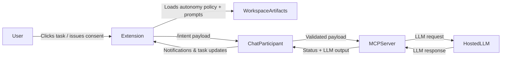
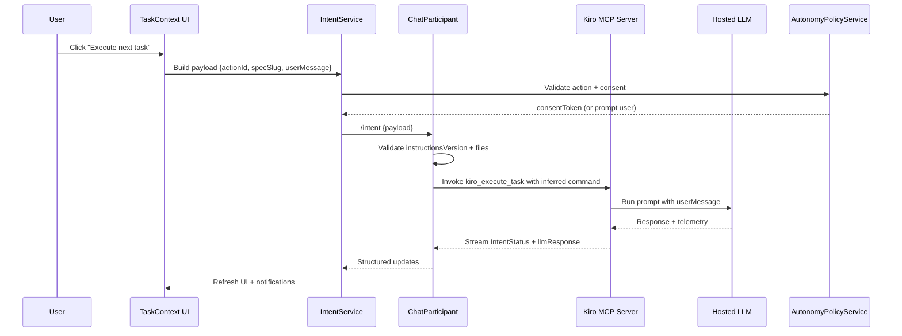

# Technical Design: Autonomous MCP Flow Enhancements

## Document Information
- **Feature Name**: Autonomous MCP Flow Enhancements
- **Version**: 1.0
- **Date**: 2025-11-17
- **Author**: Kiro
- **Reviewers**: TBD
- **Related Documents**: `requirements.md`

## Overview
This design adds a policy-driven autonomy layer on top of the existing Kiro VS Code extension and MCP prompts. The solution has four pillars:
1. **Instruction & Prompt Policy** – `.github/instructions` and prompt files enumerate approved autonomous actions, the consent phrases required to unlock them, and the MCP tooling prerequisites for each workflow.
2. **Agent & Prompt Metadata** – Every prompt/agent file gains structured front matter (mirrored in an `autonomy.manifest.json`) so both the extension and MCP server understand available tools, intent schema, and policy versions.
3. **Extension Intent Pipeline** – New services translate user actions (tree view, `/task`, future buttons) into structured intent payloads that @kiro can consume directly, eliminating manual copy/paste while preserving fallbacks.
4. **LLM Execution Bridge** – MCP tools invoke the same LLM configuration as the agent using the supplied user message, then stream the generated response plus telemetry back to the extension so downstream steps have precise context of what ran.

### Design Goals
- Capture explicit user consent before invoking MCP tools autonomously and document those policies in synced instructions.
- Keep prompts, instructions, manifest metadata, and the extension perfectly aligned via versioning.
- Provide structured intent and status plumbing so UI surfaces can initiate, observe, and (if needed) abort autonomous flows.
- Ensure every MCP tool call produces the LLM output text (and metrics) that guided the action so the agent never loses context even when actions execute asynchronously.
- Preserve deterministic manual workflows as a fallback when autonomy is disabled or consent expires.

### Key Design Decisions
- Introduce `prompts/autonomy.manifest.json` as the single source of truth for action metadata, policy versions, and consent phrases.
- Implement `AutonomyPolicyService` and `IntentService` inside the extension to manage consent, build `/intent` payloads, and reconcile status updates.
- Extend `ChatParticipant` with an `/intent` command that validates payloads, invokes the appropriate MCP tool, and handles fallback messaging.
- Embed LLM invocation into MCP tool workflows (`kiro_execute_task`, `kiro_create_requirements`, etc.) so each tool runs its referenced prompt with the provided user message and attaches the LLM response/telemetry to the final result envelope.

## Architecture

### System Context


### High-Level Architecture
```mermaid
graph TD
    A[SetupService] -->|copies| B[.github instructions/prompts]
    B -->|contains| C[autonomy.manifest.json]
    C -->|loaded by| D[AutonomyPolicyService]
    D -->|authorizes| E[IntentService]
    E -->|sends payload| F[/intent command]
    F -->|handled by| G[ChatParticipant]
    G -->|invokes| H[MCP tools]
    H -->|delegates| I[LLM Invocation Bridge]
    I -->|calls| J[Hosted LLM]
    J -->|response+telemetry| I
    H -->|status events| K[TaskContextProvider]
    K -->|refresh| L[UI views]
```

### Technology Stack
| Layer | Technology | Rationale |
| --- | --- | --- |
| Policy definition | JSON + Markdown front matter | Human-readable, versioned, easy to consume in TS and prompts |
| Extension services | TypeScript (VS Code API, `vscode.chat` APIs) | Consistent with existing extension architecture |
| MCP server | Node.js (existing `mcp-server` package) with new LLM bridge helpers | Central place to call Copilot LLM with workspace prompts |
| Prompts/Instructions | Markdown with YAML front matter | Allows metadata + prose in a single artifact |
| LLM access | GitHub Copilot Chat (current) via MCP helper | Ensures parity between manual and autonomous executions |

## Components and Interfaces

### AutonomyPolicyService (new)
**Purpose**: Load `autonomy.manifest.json` from `.github/prompts`, validate compatibility, and manage consent tokens.

**Responsibilities**:
- Parse policy versions, available actions, consent phrases, and workspace capability flags.
- Cache policy data and watch for file changes to invalidate stale entries.
- Store consent tokens/expiry in `ExtensionContext.workspaceState` and expose `isActionAllowed` / `requireConsent` helpers.
- Emit descriptive errors when policy files are missing, incompatible, or outdated.

**Key Interfaces**:
```typescript
interface AutonomyPolicy {
    version: string;
    consent: {
        phrase: string;
        expiresMinutes: number;
    };
    actions: AutonomyAction[];
}

interface AutonomyAction {
    id: string;
    tool: 'kiro_execute_task' | 'kiro_create_requirements' | 'kiro_create_tasks';
    description: string;
    requiresConsent: boolean;
    requiresFiles: string[];
    intentSchema: string[];
}

interface ConsentState {
    actionId: string;
    grantedAt: number;
    expiresAt: number;
    token: string;
}
```

### IntentService (new)
**Purpose**: Build structured `/intent` payloads from UI actions and dispatch them to @kiro.

**Responsibilities**:
- Collect spec slug, task metadata, policy version, and current consent token.
- Prompt for consent when required, using policy-provided phrases and expiry windows.
- Call `vscode.chat.requestChatAccess` to send `/intent {payload}`; fall back to opening Copilot chat if direct access fails.
- Subscribe to streaming updates (intent status events, LLM telemetry) and fan them out to `TaskContextProvider`.

**Interface**:
```typescript
interface IntentPayload {
    actionId: string;
    specSlug?: string;
    taskId?: number;
    taskLabel?: string;
    activationSource: 'taskTree' | 'slashCommand' | 'button';
    instructionsVersion: string;
    consentToken?: string;
    userMessage: string;
}
```

### ChatParticipant (/intent enhancements)
- Register `/intent` slash command and route payloads to validation logic.
- Compare `instructionsVersion` with the bundled manifest; reject mismatches.
- Ensure all required files (steering, requirements, design, tasks) exist before calling MCP tools.
- Forward payload to the MCP server by constructing the command text the tool expects (`Use kiro_execute_task with command: ...`).
- Emit structured markdown responses containing:
  - Status updates (queued/running/success/fail)
  - Whether autonomy remained enabled or fell back to manual copy
  - LLM snippets or summarized telemetry for the user log

### SetupService updates
- Copy the entire `prompts/` tree plus `autonomy.manifest.json` to `.github/prompts` on every setup run, tracking stats via `CopyStats`.
- Stamp `autonomyPolicyVersion` into `.github/instructions/BASE_SYSTEM_PROMPT.instructions.md` front matter and create `.github/prompts/autonomy-version.json` for quick version checks.
- Warn users (non-fatal) when local instructions lag behind the bundled manifest so they rerun setup before enabling autonomy.

### Prompt & Agent Metadata
- Add YAML front matter describing supported actions, intent fields, consent requirements, and `policyVersion` for every prompt (`requirements`, `design`, `executeTask`, etc.) plus `prompts/agents/kiro.agent.md`.
- Replace "copy this command" wording with directives like "When you receive an intent payload, call the referenced MCP tool directly".
- Reference the LLM bridge explicitly: "Call the configured LLM with `userMessage` and include the generated text in your MCP response envelope".

### TaskContextProvider & Commands
- Display autonomy badges when policy + consent allow a given spec/task to run automatically.
- Provide inline actions: "Execute next autonomously", "Retry autonomously", each calling `IntentService.dispatch` with the appropriate `actionId`.
- Listen for `IntentStatus` events to render progress nodes (⏳ Running, ✅ Completed, ⚠️ Failed) inside the tree.
- Add a `kiro-copilot.enableAutonomy` command that simply calls `AutonomyPolicyService.requestConsent(actionId)` so users can opt-in without clicking a task.

### MCP LLM Invocation Bridge (new)
**Purpose**: Guarantee that every MCP tool invocation runs the correct prompt against the agent’s LLM, captures the response text + telemetry, and returns it to the extension.

**Responsibilities**:
- Accept `userMessage`, tool metadata, and prompt identifiers from the MCP tool entrypoint.
- Resolve the appropriate prompt template (e.g., `prompts/prompts/executeTask.prompt.md`) and merge it with the user payload.
- Call the hosted LLM (Copilot) via existing MCP server plumbing, streaming `IntentStatus` events (`queued`, `running`, `completed`, `failed`).
- Populate `llmResponse`, token counts, latency, and error codes in the MCP result envelope so ChatParticipant can present them or attach to follow-up intents.

**Implementation Notes**:
- Lives inside `mcp-server/src` and is reused by every MCP tool helper.
- Enforces workspace scoping by disallowing file paths outside the root and redacting secrets prior to sending prompts.
- Falls back gracefully if LLM calls fail (returns structured error to the extension and requests manual retry).

## Data Models
```typescript
interface IntentStatus {
    intentId: string;
    stage: 'queued' | 'running' | 'completed' | 'failed';
    message: string;
    timestamp: number;
}

interface ConsentState {
    actionId: string;
    grantedAt: number;
    expiresAt: number;
    token: string;
}

interface LLMRunResult {
    intentId: string;
    tool: string;
    llmResponse: string;
    tokenUsage: {
        prompt: number;
        completion: number;
        total: number;
    };
    latencyMs: number;
    status: 'succeeded' | 'failed';
    errorCode?: string;
}
```

**Instructions Front Matter Example**
```markdown
---
autonomyPolicyVersion: "2025.11"
approvedActions:
  - id: executeTask.next
    consentPhrase: "@kiro continue autonomously"
    description: "Run the next unchecked task in the active spec"
  - id: executeTask.retry
    consentPhrase: "@kiro retry autonomously"
    description: "Retry the previously failed task"
---
```

**Autonomy Manifest Example (`prompts/autonomy.manifest.json`)**
```json
{
  "version": "2025.11",
  "consent": {
    "phrase": "@kiro continue autonomously",
    "expiresMinutes": 30
  },
  "actions": [
    {
      "id": "executeTask.next",
      "tool": "kiro_execute_task",
      "description": "Run the next unchecked task in the selected spec",
      "requiresConsent": true,
      "requiresFiles": [".kiro/steering", ".kiro/specs/<slug>/design.md", ".kiro/specs/<slug>/tasks.md"],
      "intentSchema": ["specSlug"],
      "requiresLLM": true
    },
    {
      "id": "executeTask.retry",
      "tool": "kiro_execute_task",
      "description": "Retry the last task (expect taskId)",
      "requiresConsent": true,
      "intentSchema": ["specSlug", "taskId"],
      "requiresLLM": true
    }
  ]
}
```

## Data Flow


## API & Prompt Updates
- `/intent` payload gains a mandatory `userMessage` and MCP responses add `llmResponse` plus token/latency telemetry.
- Chat participant returns structured JSON blocks (wrapped in fenced code) for both success and failure so the extension can parse reason codes.
- Prompts instruct the MCP server to prefer direct tool invocation over manual copy and to echo the LLM output in the response envelope.
- Agent metadata mentions "Supports versioned autonomy and LLM context capture when consent token is present." 

**/intent Payload Example**
```json
{
  "actionId": "executeTask.next",
  "specSlug": "autonomous-mcp-flows",
  "taskId": 3,
  "instructionsVersion": "2025.11",
  "consentToken": "abc123",
  "userMessage": "Implement the next task in the autonomous flow",
  "activationSource": "taskTree"
}
```

## Security Considerations
- Validate `specSlug` and referenced file paths (only alphanumeric + hyphen) before reading.
- Store consent tokens only in memory-scoped workspace state; purge them upon VS Code shutdown or manual opt-out.
- Clamp outbound LLM prompts to workspace-owned data and strip secrets from payloads.
- Reject `/intent` payloads when instructions/manifest versions mismatch or when the manifest lacks required LL M metadata.
- Require explicit consent before any LLM invocation that performs write actions on behalf of the user.

## Error Handling
- `AutonomyPolicyService` reports missing/invalid manifest files with remediation guidance (rerun setup).
- `IntentService.dispatch` captures chat API failures and triggers manual fallback instructions.
- LLM bridge wraps failures (timeouts, quota, validation) in structured error responses containing `errorCode`, `message`, and `fallbackRequired`.
- Chat participant surfaces errors via markdown blocks so the extension can parse them and annotate the Task tree.

## Performance Considerations
- Cache manifest + prompt metadata but watch files for changes to avoid stale policies.
- Use a bounded concurrency pool (default 2) for LLM executions to avoid rate-limit spikes; queue additional intents with back-pressure messaging in the Task view.
- Apply a default 60s timeout to LLM calls; stream heartbeats every 5s so the UI can display progress.
- Throttle Task tree refreshes to once per second while intents are active.

## Testing Strategy
- **Unit Tests**: Cover `AutonomyPolicyService` (parsing, consent expiry), `IntentService` (payload validation, fallback), `/intent` handler (happy path + rejection), and `runPromptWithLLM` (success + error telemetry propagation).
- **Integration Tests**: Run the extension in an Extension Development Host, trigger `startTaskFromFile`, verify `/intent` dispatch + LLM streaming, and assert manual fallback when manifest is missing.
- **Prompt/Instruction Snapshot Tests**: Verify every prompt front matter references the correct `policyVersion`, supported actions, and `requiresLLM` flag.
- **Manual Validation**: Confirm UI badges, consent prompts, streaming status updates, and LLM snippets all behave as expected with autonomy on/off.

Does the technical design look good? If so, we can proceed to implementation planning.
