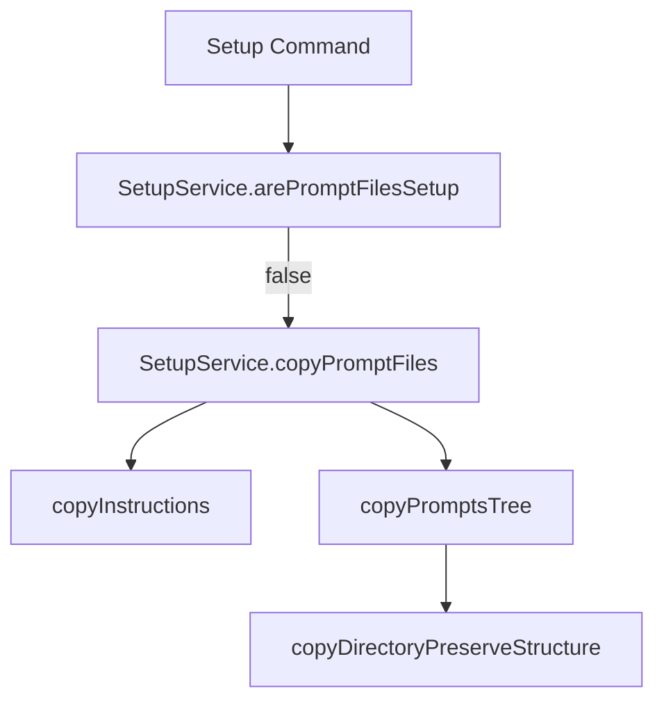
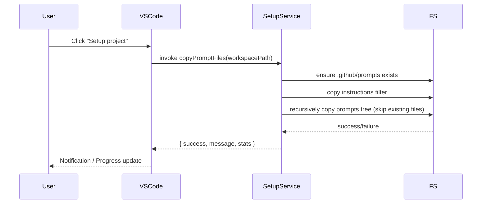

# Technical Design: Setup Project Prompt Sync

## Document Information
- **Feature Name**: Setup Project Prompt Sync
- **Version**: 1.0
- **Date**: 2025-11-17
- **Author**: Kiro
- **Reviewers**: TBD
- **Related Documents**: `requirements.md`

## Overview
The design extends the existing `SetupService.copyPromptFiles` pipeline so the `"Setup project"` command mirrors the entire bundled `prompts/` directory (both instructions and prompt templates) into the active workspace's `.github/prompts` folder on every run. The process must be idempotent, preserve subdirectories, and emit clear success/error telemetry through VS Code notifications and the existing progress UI.

### Design Goals
- Ensure every workspace ends setup with a complete `.github/prompts` tree matching the extension bundle.
- Preserve user-created files both outside the prompts subtree and within it (existing prompt files stay untouched).
- Provide reliable messaging about copy counts, skips, and failures without blocking the UI thread.

### Key Design Decisions
- Reuse the existing `copyDirectory` helper with a new filter to exclude `.instructions` files and to target `.github/prompts` only; instructions remain handled by the existing filtered copy.
- Perform the prompts copy synchronously (Node `fs`) inside the progress block to minimize extra async complexity; the folder depth is small.
- Report copy statistics (files created, skipped due to existing, and failed) via the command's progress notifications and the info/warning messages currently shown.

## Architecture

### System Context
```mermaid
graph LR
    User[VS Code User] -->|Runs "Setup project"| Command[kiro-copilot.setupProject]
    Command --> SetupService
    SetupService -->|Reads| ExtensionPrompts[Extension prompts/]
    SetupService -->|Writes| WorkspacePrompts[Workspace .github/prompts/]
    SetupService -->|Notifies| VSCode[vscode.window UI]
```

The existing setup command orchestrates MCP server bootstrapping, prompt provisioning, and MCP config updates. The new behavior plugs into the same flow right after prompt detection.

### High-Level Architecture


### Technology Stack
| Layer | Technology | Rationale |
| --- | --- | --- |
| Extension Host | VS Code API + Node `fs`, `path` | Already used throughout setup routines |
| UI Feedback | `vscode.window` notifications/progress | Provides consistent UX |

## Components and Interfaces

### Component: SetupService
**Purpose**: Own all filesystem operations required to bootstrap a workspace for Kiro flows.

**Responsibilities**:
- Detect whether prompts/instructions already exist.
- Copy instruction files into `.github/instructions`.
- Mirror the bundled prompts tree into `.github/prompts` while skipping files that already exist.
- Surface copy and error statistics to the caller.

**Interfaces**:
- **Input**: `workspacePath: string`
- **Output**: `{ success: boolean; message: string; details?: CopyStats }`
- **Dependencies**: Node `fs`, `path`, VS Code progress/notification surfaces.

**Implementation Notes**:
- Introduce an internal `CopyStats` interface capturing counts of copied, overwritten, skipped, and failed files.
- Keep operations synchronous for simplicity but wrap in try/catch to isolate failures per file.

### Component: copyDirectory Helper
**Purpose**: Reusable recursive folder copy that currently excludes `node_modules` for MCP assets.

**Adaptations**:
- Accept optional filter options (e.g., `skipExtensions`, `onlyExtensions`) to reuse for prompts copy.
- For prompt mirroring, allow directories to be copied wholesale, leveraging `fs.cpSync` when available (Node 16+), falling back to manual recursion otherwise.

## Data Models

```typescript
interface CopyStats {
    created: number;
    skipped: number;
    failed: Array<{ relativePath: string; error: string }>;
}
```

These stats inform user notifications and potential telemetry.

## Data Flow


## API & Database Changes
No HTTP APIs or database schemas are affected. Mentioning explicitly satisfies the template.

## Security Considerations
- Validate destination paths by anchoring to `workspacePath/.github/prompts` to avoid accidental writes outside the workspace.
- Sanitize relative paths when reporting failures to prevent leaking host filesystem details (only show workspace-relative paths).
- Respect file permissions; handle `EACCES` by logging and continuing instead of crashing.

## Error Handling
- Collect per-file errors, continue copying remaining files, and include a summary list (limited to e.g., five entries) in the warning message.
- If the source `prompts/` directory is missing, short-circuit with a descriptive failure so the caller can instruct the user to reinstall.
- Bubble up fatal errors (e.g., inability to create `.github`) as `success: false` to allow the command to halt.

## Performance Considerations
- Copy operations run synchronously but the dataset is small (< 100 files). Expect completion in <2s.
- Avoid redundant `fs.statSync` calls by reusing metadata where possible; simple recursion suffices.

## Testing Strategy
- **Unit Tests**: Add tests around a refactored `copyPromptFiles` helper using temp directories to cover scenarios (clean workspace, existing files overwritten, partial failures).
- **Integration Tests**: Manual verification by running the command within an Extension Development Host workspace and inspecting `.github/prompts` contents.
- **Regression Checks**: Ensure `arePromptFilesSetup` still reports true when the mirrored tree exists and that MCP config/setup flows remain unaffected.

Does the technical design look good? If so, we can proceed to implementation planning.
