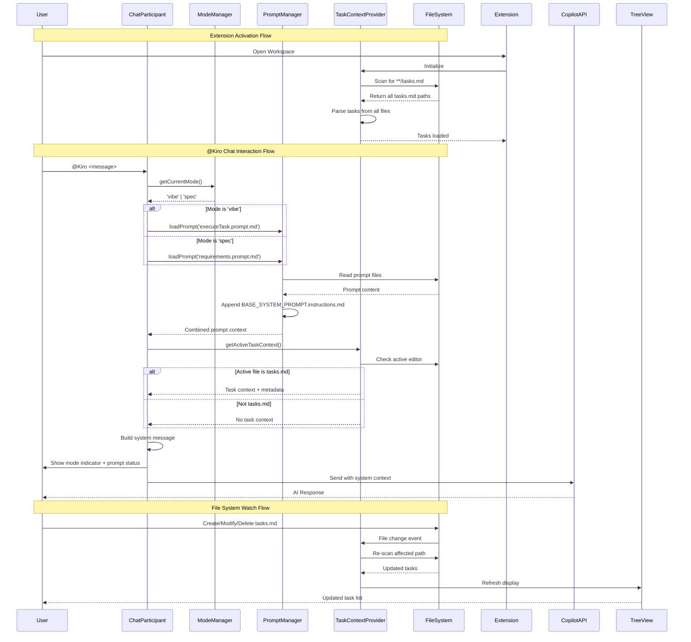

# Technical Design: Task Discovery and Prompt Integration Enhancement

## 1. Architectural Overview

This design enhances the existing Kiro VS Code extension with three major capabilities:

1. **Recursive Task Discovery System** - Extends the current `TaskContextProvider` to scan the entire workspace hierarchy for `tasks.md` files
2. **Enhanced Prompt Integration** - Improves the `PromptManager` to reliably load mode-specific prompts with proper fallback mechanisms
3. **Mode-Aware Chat Participant** - Augments the `ChatParticipant` to automatically apply mode-specific prompts when `@Kiro` is invoked

The solution integrates seamlessly with the existing architecture:
- Leverages the current `ModeManager` for mode state
- Extends `TaskContextProvider` with recursive scanning capabilities
- Enhances `PromptManager` with validation and error handling
- Modifies `ChatParticipant` to auto-apply `/executeTask` or `/requirements` prompts

### Integration Points

```
Extension Core (extension.ts)
    │
    ├─► ModeManager (existing) - Mode state management
    │
    ├─► PromptManager (enhanced) - Recursive prompt loading
    │       ├─► Validates prompts folder
    │       ├─► Loads mode-specific prompts
    │       └─► Caches with invalidation
    │
    ├─► TaskContextProvider (enhanced) - Recursive task discovery
    │       ├─► Scans workspace recursively
    │       ├─► Watches for file changes
    │       └─► Organizes by spec folders
    │
    └─► ChatParticipant (enhanced) - Mode-aware chat
            ├─► Auto-applies executeTask.prompt.md (vibe mode)
            ├─► Auto-applies requirements.prompt.md (spec mode)
            └─► Includes task context from active file
```

---

## 2. Data Flow Diagram



---

## 3. Component & Interface Definitions

### 3.1 Enhanced TaskContextProvider

```typescript
// New interfaces
interface TaskScanResult {
    filePath: string;
    relativePath: string;
    tasks: TaskItem[];
    lastModified: number;
    specFolder?: string;
}

interface WorkspaceTaskMap {
    [filePath: string]: TaskScanResult;
}

// Enhanced TaskContextProvider class
export class TaskContextProvider implements vscode.TreeDataProvider<TaskTreeItem> {
    private taskCache: WorkspaceTaskMap = {};
    private fileWatcher: vscode.FileSystemWatcher | undefined;
    private scanInProgress: boolean = false;
    private lastScanTimestamp: number = 0;
    private readonly DEBOUNCE_DELAY = 1000; // 1 second

    constructor(
        private promptManager: PromptManager,
        private modeManager: ModeManager
    ) {
        this.initializeFileWatcher();
        this.performInitialScan();
    }

    /**
     * Initialize file system watcher for tasks.md files
     */
    private initializeFileWatcher(): void {
        // Watch pattern: **/tasks.md and .kiro/specs/**/tasks.md
        this.fileWatcher = vscode.workspace.createFileSystemWatcher(
            '**/{tasks.md,.kiro/specs/**/tasks.md}'
        );

        this.fileWatcher.onDidCreate((uri) => this.handleFileChange(uri, 'create'));
        this.fileWatcher.onDidChange((uri) => this.handleFileChange(uri, 'change'));
        this.fileWatcher.onDidDelete((uri) => this.handleFileChange(uri, 'delete'));
    }

    /**
     * Handle file system changes with debouncing
     */
    private async handleFileChange(
        uri: vscode.Uri, 
        changeType: 'create' | 'change' | 'delete'
    ): Promise<void> {
        const now = Date.now();
        
        // Debounce rapid changes
        if (now - this.lastScanTimestamp < this.DEBOUNCE_DELAY) {
            return;
        }

        this.lastScanTimestamp = now;

        if (changeType === 'delete') {
            delete this.taskCache[uri.fsPath];
        } else {
            await this.scanSingleFile(uri.fsPath);
        }

        this.refresh();
    }

    /**
     * Recursively scan workspace for all tasks.md files
     */
    private async performInitialScan(): Promise<void> {
        if (this.scanInProgress) {
            return;
        }

        this.scanInProgress = true;
        const workspaceFolders = vscode.workspace.workspaceFolders;

        if (!workspaceFolders) {
            this.scanInProgress = false;
            return;
        }

        try {
            // Use VS Code's findFiles API which respects .gitignore
            const taskFiles = await vscode.workspace.findFiles(
                '**/tasks.md',
                '**/node_modules/**',
                10000 // max results
            );

            // Show progress if more than 10 files
            if (taskFiles.length > 10) {
                await vscode.window.withProgress({
                    location: vscode.ProgressLocation.Notification,
                    title: 'Scanning workspace for tasks...',
                    cancellable: false
                }, async (progress) => {
                    for (let i = 0; i < taskFiles.length; i++) {
                        await this.scanSingleFile(taskFiles[i].fsPath);
                        progress.report({
                            increment: (100 / taskFiles.length),
                            message: `${i + 1}/${taskFiles.length} files`
                        });
                    }
                });
            } else {
                // Scan without progress indicator
                await Promise.all(
                    taskFiles.map(file => this.scanSingleFile(file.fsPath))
                );
            }

            this.refresh();
        } catch (error) {
            vscode.window.showErrorMessage(
                `Failed to scan workspace for tasks: ${error}`
            );
        } finally {
            this.scanInProgress = false;
        }
    }

    /**
     * Scan a single tasks.md file and update cache
     */
    private async scanSingleFile(filePath: string): Promise<void> {
        try {
            const workspaceFolder = vscode.workspace.workspaceFolders?.[0];
            if (!workspaceFolder) {
                return;
            }

            const relativePath = path.relative(workspaceFolder.uri.fsPath, filePath);
            const stat = await fs.stat(filePath);
            
            // Determine if this is part of a spec folder
            const specFolderMatch = relativePath.match(/\.kiro[\/\\]specs[\/\\]([^\/\\]+)/);
            const specFolder = specFolderMatch ? specFolderMatch[1] : undefined;

            // Parse tasks from file
            const tasks = await this.parseTasksFromFile(filePath, specFolder);

            // Update cache
            this.taskCache[filePath] = {
                filePath,
                relativePath,
                tasks,
                lastModified: stat.mtimeMs,
                specFolder
            };

        } catch (error) {
            console.error(`Failed to scan file ${filePath}:`, error);
            
            // Check if it's a permission error
            if ((error as NodeJS.ErrnoException).code === 'EACCES') {
                vscode.window.showWarningMessage(
                    `Permission denied reading ${filePath}`
                );
            }
        }
    }

    /**
     * Get active task context from currently open editor
     */
    public getActiveTaskContext(): TaskContext | undefined {
        const editor = vscode.window.activeTextEditor;
        
        if (!editor || !editor.document.fileName.endsWith('tasks.md')) {
            return undefined;
        }

        const filePath = editor.document.fileName;
        const scanResult = this.taskCache[filePath];
        
        if (!scanResult) {
            return undefined;
        }

        // Get task at cursor position
        const cursorLine = editor.selection.active.line;
        const taskAtCursor = scanResult.tasks.find(
            task => task.lineNumber === cursorLine
        );

        // Get selected text
        const selectedText = editor.document.getText(editor.selection);

        return {
            filePath,
            relativePath: scanResult.relativePath,
            specFolder: scanResult.specFolder,
            allTasks: scanResult.tasks,
            activeTask: taskAtCursor,
            selectedText: selectedText || undefined
        };
    }

    /**
     * Get all tasks organized by spec folder
     */
    public getAllTasksBySpec(): Map<string | undefined, TaskScanResult[]> {
        const organized = new Map<string | undefined, TaskScanResult[]>();

        for (const scanResult of Object.values(this.taskCache)) {
            const key = scanResult.specFolder || undefined;
            
            if (!organized.has(key)) {
                organized.set(key, []);
            }
            
            organized.get(key)!.push(scanResult);
        }

        return organized;
    }

    // Existing methods remain...
}

// New type for task context
interface TaskContext {
    filePath: string;
    relativePath: string;
    specFolder?: string;
    allTasks: TaskItem[];
    activeTask?: TaskItem;
    selectedText?: string;
}
```

### 3.2 Enhanced PromptManager

```typescript
export class PromptManager {
    private promptCache: Map<string, PromptCacheEntry> = new Map();
    private extensionContext?: vscode.ExtensionContext;
    private validatedPromptsPath?: string;

    constructor(context?: vscode.ExtensionContext) {
        this.extensionContext = context;
        this.watchConfigurationChanges();
    }

    /**
     * Watch for configuration changes and invalidate cache
     */
    private watchConfigurationChanges(): void {
        vscode.workspace.onDidChangeConfiguration((event) => {
            if (event.affectsConfiguration('kiroCopilot.promptsPath')) {
                this.validatedPromptsPath = undefined;
                this.clearCache();
                console.log('Prompts path configuration changed, cache cleared');
            }
        });
    }

    /**
     * Get and validate prompts path
     */
    async getPromptsPath(): Promise<string> {
        if (this.validatedPromptsPath) {
            return this.validatedPromptsPath;
        }

        // Priority 1: Embedded prompts in extension
        if (this.extensionContext) {
            const embeddedPath = path.join(
                this.extensionContext.extensionPath, 
                'prompts'
            );
            
            if (await this.pathExists(embeddedPath)) {
                this.validatedPromptsPath = embeddedPath;
                return embeddedPath;
            }
        }

        // Priority 2: User-configured path
        const config = vscode.workspace.getConfiguration('kiroCopilot');
        let configuredPath = config.get<string>('promptsPath');

        if (configuredPath) {
            // Expand environment variables
            configuredPath = this.expandEnvVars(configuredPath);
            
            // Resolve relative paths
            if (!path.isAbsolute(configuredPath)) {
                const workspaceRoot = vscode.workspace.workspaceFolders?.[0]?.uri.fsPath;
                if (workspaceRoot) {
                    configuredPath = path.join(workspaceRoot, configuredPath);
                }
            }

            if (await this.pathExists(configuredPath)) {
                this.validatedPromptsPath = configuredPath;
                return configuredPath;
            }
        }

        // Priority 3: Default user prompts folder
        const defaultPath = path.join(
            process.env.APPDATA || process.env.HOME || '',
            'Code',
            'User',
            'prompts'
        );

        if (await this.pathExists(defaultPath)) {
            this.validatedPromptsPath = defaultPath;
            return defaultPath;
        }

        // No valid path found
        throw new Error(
            `Prompts directory not found. Checked: ${[
                embeddedPath,
                configuredPath,
                defaultPath
            ].filter(Boolean).join(', ')}`
        );
    }

    /**
     * Load mode-specific prompt with validation
     */
    async getPromptForMode(mode: CodingMode): Promise<string> {
        const promptsPath = await this.getPromptsPath();

        // Define required prompts for each mode
        const promptFiles: Record<CodingMode, string[]> = {
            'vibe': ['executeTask.prompt.md', 'BASE_SYSTEM_PROMPT.instructions.md'],
            'spec': ['requirements.prompt.md', 'BASE_SYSTEM_PROMPT.instructions.md']
        };

        const files = promptFiles[mode];
        const loadedPrompts: string[] = [];
        const missingFiles: string[] = [];

        for (const file of files) {
            const filePath = path.join(promptsPath, file);
            
            try {
                const content = await this.loadPromptFile(filePath);
                
                if (content) {
                    loadedPrompts.push(content);
                } else {
                    missingFiles.push(file);
                }
            } catch (error) {
                console.warn(`Failed to load prompt ${file}:`, error);
                missingFiles.push(file);
            }
        }

        // Handle missing files
        if (missingFiles.length > 0) {
            const message = `Missing prompt files in ${promptsPath}: ${missingFiles.join(', ')}`;
            console.error(message);
            
            vscode.window.showWarningMessage(
                `Some prompt files could not be loaded. Check extension output for details.`,
                'Open Settings'
            ).then(selection => {
                if (selection === 'Open Settings') {
                    vscode.commands.executeCommand(
                        'workbench.action.openSettings',
                        'kiroCopilot.promptsPath'
                    );
                }
            });
        }

        // Return combined prompts or throw if critical files missing
        if (loadedPrompts.length === 0) {
            throw new Error(`No prompt files could be loaded for ${mode} mode`);
        }

        return loadedPrompts.join('\n\n---\n\n');
    }

    /**
     * Load prompt file with caching and validation
     */
    async loadPromptFile(filePath: string): Promise<string | undefined> {
        // Check cache
        const cached = this.promptCache.get(filePath);
        
        if (cached) {
            const stat = await fs.stat(filePath);
            
            // Cache hit if file hasn't been modified
            if (stat.mtimeMs === cached.lastModified) {
                return cached.content;
            }
        }

        try {
            const content = await fs.readFile(filePath, 'utf-8');
            const stat = await fs.stat(filePath);

            // Warn about large files
            if (Buffer.byteLength(content, 'utf-8') > 50000) {
                console.warn(
                    `Prompt file ${path.basename(filePath)} exceeds 50KB. ` +
                    `This may impact token usage.`
                );
            }

            // Cache the content
            this.promptCache.set(filePath, {
                content,
                lastModified: stat.mtimeMs
            });

            return content;
        } catch (error) {
            console.error(`Failed to load prompt file ${filePath}:`, error);
            return undefined;
        }
    }

    /**
     * Expand environment variables in path
     */
    private expandEnvVars(str: string): string {
        return str.replace(/%([^%]+)%/g, (_, varName) => {
            return process.env[varName] || '';
        });
    }

    /**
     * Check if path exists
     */
    private async pathExists(path: string): Promise<boolean> {
        try {
            await fs.access(path);
            return true;
        } catch {
            return false;
        }
    }

    // Existing methods remain...
}

// New interface for cache entries
interface PromptCacheEntry {
    content: string;
    lastModified: number;
}
```

### 3.3 Enhanced ChatParticipant

```typescript
export class ChatParticipant {
    constructor(
        private modeManager: ModeManager,
        private promptManager: PromptManager,
        private taskContextProvider: TaskContextProvider
    ) {}

    register(): vscode.Disposable {
        const participant = vscode.chat.createChatParticipant(
            'kiro-copilot.assistant',
            this.handleChatRequest.bind(this)
        );

        participant.iconPath = vscode.Uri.file('resources/kiro-icon.svg');
        return participant;
    }

    private async handleChatRequest(
        request: vscode.ChatRequest,
        context: vscode.ChatContext,
        stream: vscode.ChatResponseStream,
        token: vscode.CancellationToken
    ): Promise<void> {
        // Handle explicit slash commands first
        if (request.command) {
            await this.handleSlashCommand(request, stream);
            return;
        }

        // Auto-apply mode-specific prompts for regular @Kiro invocations
        await this.handleModeSpecificChat(request, context, stream, token);
    }

    private async handleSlashCommand(
        request: vscode.ChatRequest,
        stream: vscode.ChatResponseStream
    ): Promise<void> {
        switch (request.command) {
            case 'vibe':
                await this.switchToVibeMode(stream);
                break;
            case 'spec':
                await this.switchToSpecMode(stream);
                break;
            case 'task':
                await this.handleTaskCommand(request, stream);
                break;
            default:
                stream.markdown(`Unknown command: /${request.command}\n`);
        }
    }

    private async handleModeSpecificChat(
        request: vscode.ChatRequest,
        context: vscode.ChatContext,
        stream: vscode.ChatResponseStream,
        token: vscode.CancellationToken
    ): Promise<void> {
        const mode = this.modeManager.getCurrentMode();
        
        // Load mode-specific prompt
        let systemPrompt: string;
        
        try {
            systemPrompt = await this.promptManager.getPromptForMode(mode);
        } catch (error) {
            stream.markdown(`⚠️ Error loading prompts: ${error}\n\n`);
            stream.markdown('Falling back to base instructions only.\n');
            
            // Attempt to load just the base prompt
            try {
                systemPrompt = await this.promptManager.loadPromptFile(
                    path.join(
                        await this.promptManager.getPromptsPath(),
                        'BASE_SYSTEM_PROMPT.instructions.md'
                    )
                ) || '';
            } catch {
                stream.markdown('❌ Could not load any prompt files.\n');
                return;
            }
        }

        // Get task context if available
        const taskContext = this.taskContextProvider.getActiveTaskContext();

        // Build context message for user
        this.showContextIndicator(stream, mode, taskContext);

        // Build system message for LLM (this would be sent to Copilot API)
        const systemMessage = this.buildSystemMessage(
            systemPrompt,
            mode,
            taskContext,
            request.prompt
        );

        // Log for debugging
        console.log('Mode:', mode);
        console.log('System prompt length:', systemPrompt.length);
        console.log('Has task context:', !!taskContext);

        // Note: In production, systemMessage would be sent to the LLM
        // For now, we're showing the user what context is loaded
        stream.markdown('---\n\n');
        stream.markdown(`Your message: ${request.prompt}\n\n`);
        stream.markdown('*Context has been loaded and applied.*\n');
    }

    private showContextIndicator(
        stream: vscode.ChatResponseStream,
        mode: CodingMode,
        taskContext?: TaskContext
    ): void {
        const modeLabel = mode === 'vibe' ? 'Vibe Coding 🎯' : 'Spec 📋';
        const promptLabel = mode === 'vibe' ? 
            'Execute Task workflow + Base instructions' :
            'Requirements workflow + Base instructions';

        if (taskContext) {
            stream.markdown(`Working in **${modeLabel}** mode with \`${taskContext.relativePath}\`\n\n`);
            stream.markdown(`Mode-specific prompt applied (${promptLabel})\n\n`);
            
            if (taskContext.activeTask) {
                stream.markdown(`**Active task:** ${taskContext.activeTask.label}\n\n`);
            } else if (taskContext.allTasks.length > 0) {
                stream.markdown(`**Task context:** ${taskContext.allTasks.length} task(s) available\n\n`);
            }

            if (taskContext.specFolder) {
                stream.markdown(`**Spec folder:** ${taskContext.specFolder}\n\n`);
            }
        } else {
            stream.markdown(`*${modeLabel} mode active*\n\n`);
            stream.markdown(`Mode-specific prompt applied (${promptLabel})\n\n`);
        }
    }

    private buildSystemMessage(
        systemPrompt: string,
        mode: CodingMode,
        taskContext: TaskContext | undefined,
        userMessage: string
    ): string {
        let message = systemPrompt;

        if (taskContext) {
            message += '\n\n# Current Task Context\n\n';
            message += `File: ${taskContext.relativePath}\n`;
            
            if (taskContext.specFolder) {
                message += `Spec Folder: ${taskContext.specFolder}\n`;
            }

            if (taskContext.activeTask) {
                message += `\n## Active Task\n\n`;
                message += `${taskContext.activeTask.label}\n`;
                message += `Status: ${taskContext.activeTask.status}\n`;
                message += `Content: ${taskContext.activeTask.taskContent}\n`;
            } else if (taskContext.allTasks.length > 0) {
                message += `\n## Available Tasks (${taskContext.allTasks.length})\n\n`;
                taskContext.allTasks.forEach(task => {
                    message += `- [${task.status}] ${task.label}\n`;
                });
            }

            if (taskContext.selectedText) {
                message += `\n## Selected Text\n\n`;
                message += taskContext.selectedText;
            }
        }

        message += '\n\n# User Request\n\n';
        message += userMessage;

        return message;
    }

    // Existing methods remain...
}
```

---

## 4. API Endpoint Definitions

N/A - This is a VS Code extension with no external API endpoints. All interactions are through VS Code's Extension API.

---

## 5. Database Schema Changes

N/A - This extension does not use a database. State is managed in-memory and persisted through VS Code's workspace state API.

---

## 6. Security Considerations

### 6.1 File System Access

**Risk:** Extension reads arbitrary files from the workspace and configured prompts directory.

**Mitigation:**
- Respect VS Code's file exclusion patterns (`.gitignore`, `.vscodeignore`)
- Validate all file paths before reading to prevent directory traversal
- Use VS Code's `findFiles` API which has built-in security controls
- Limit file watching to specific patterns (`**/tasks.md`)

### 6.2 Prompt Injection

**Risk:** Malicious content in `tasks.md` or prompt files could influence AI behavior.

**Mitigation:**
- Sanitize task content before including in system messages
- Validate prompt file sizes (warn if > 50KB)
- Use read-only access for all file operations
- Log all prompt loading operations for audit trail

### 6.3 Configuration Validation

**Risk:** Invalid `promptsPath` configuration could cause file system errors.

**Mitigation:**
- Validate and resolve all paths before file operations
- Expand environment variables safely with fallback
- Provide clear error messages for misconfigured paths
- Graceful degradation if prompts cannot be loaded

### 6.4 Performance & Resource Limits

**Risk:** Large workspaces could cause performance issues or memory exhaustion.

**Mitigation:**
- Limit `findFiles` to 10,000 results maximum
- Debounce file system events (1 second minimum)
- Use incremental cache updates instead of full rescans
- Show progress indicators for operations > 5 seconds

---

## 7. Test Strategy

### 7.1 Unit Tests

**TaskContextProvider Tests:**
- ✓ `scanSingleFile()` correctly parses all task formats
- ✓ `handleFileChange()` debounces rapid changes
- ✓ `getActiveTaskContext()` returns correct task at cursor
- ✓ `getAllTasksBySpec()` organizes tasks by spec folder
- ✓ Cache invalidation works correctly on file changes
- ✓ Permission errors are handled gracefully

**PromptManager Tests:**
- ✓ `getPromptsPath()` follows correct priority order
- ✓ `expandEnvVars()` correctly expands environment variables
- ✓ `loadPromptFile()` caches and invalidates correctly
- ✓ `getPromptForMode()` loads correct prompts for each mode
- ✓ Missing prompt files trigger appropriate warnings
- ✓ Configuration changes invalidate cache

**ChatParticipant Tests:**
- ✓ Slash commands are handled before mode-specific logic
- ✓ `@Kiro` in vibe mode loads executeTask.prompt.md
- ✓ `@Kiro` in spec mode loads requirements.prompt.md
- ✓ Task context is included when tasks.md is active
- ✓ Error messages are shown when prompts fail to load
- ✓ System message is built correctly with all context

### 7.2 Integration Tests

**End-to-End Workflows:**
- ✓ Create workspace with nested `tasks.md` files → All tasks discovered
- ✓ Modify `tasks.md` → Tree view updates within 2 seconds
- ✓ Delete `tasks.md` → Tasks removed from view
- ✓ Switch mode via `/vibe` → Next `@Kiro` uses executeTask prompt
- ✓ Switch mode via `/spec` → Next `@Kiro` uses requirements prompt
- ✓ Open `tasks.md` and use `@Kiro` → Task context included

**Configuration Tests:**
- ✓ Change `promptsPath` → Cache cleared and new path used
- ✓ Invalid `promptsPath` → Error message with guidance
- ✓ Relative `promptsPath` → Resolved from workspace root
- ✓ Environment variables in path → Correctly expanded

**Performance Tests:**
- ✓ Workspace with 1000 files → Scan completes < 5 seconds
- ✓ Workspace with 100 `tasks.md` files → All tasks discovered
- ✓ Rapid file changes → Debounced to max 1 refresh/second
- ✓ Large prompt files (> 50KB) → Warning logged

### 7.3 Error Handling Tests

**File System Errors:**
- ✓ No workspace folders → Graceful handling, no errors
- ✓ Permission denied on `tasks.md` → Warning notification shown
- ✓ Corrupted `tasks.md` → Skip malformed tasks, continue parsing
- ✓ Prompts directory missing → Error with setup instructions

**Prompt Loading Errors:**
- ✓ Missing `executeTask.prompt.md` → Fallback to base prompt
- ✓ Missing `requirements.prompt.md` → Fallback to base prompt
- ✓ All prompts missing → Clear error message

### 7.4 Manual Testing Checklist

- [ ] Install extension in clean VS Code instance
- [ ] Verify embedded prompts are used by default
- [ ] Configure custom `promptsPath`, verify it's used
- [ ] Create nested folder structure with multiple `tasks.md` files
- [ ] Verify all tasks appear in tree view
- [ ] Click on task, verify it opens with context
- [ ] Use `@Kiro` in vibe mode, verify executeTask prompt applied
- [ ] Use `@Kiro` in spec mode, verify requirements prompt applied
- [ ] Open `tasks.md`, use `@Kiro`, verify task context included
- [ ] Modify `tasks.md`, verify tree view updates automatically
- [ ] Delete `tasks.md`, verify it's removed from tree view
- [ ] Test with large workspace (1000+ files)
- [ ] Test with workspace containing no `tasks.md` files

---

## 8. Implementation Phases

### Phase 1: Enhanced Task Discovery (Requirements 1, 5)
- Implement recursive workspace scanning in `TaskContextProvider`
- Add file system watcher with debouncing
- Implement caching with incremental updates
- Add progress indicators for large scans

### Phase 2: Prompt Integration (Requirements 2, 7)
- Enhance `PromptManager` with validation and fallback
- Add configuration change watching
- Implement environment variable expansion
- Add error handling and user notifications

### Phase 3: Mode-Aware Chat (Requirements 3, 4)
- Modify `ChatParticipant` to auto-apply mode prompts
- Implement task context extraction
- Build system message with all context
- Add mode and context indicators

### Phase 4: Error Handling & Polish (Requirement 6)
- Comprehensive error messages
- User guidance for configuration issues
- Logging and debugging support
- Documentation updates

---

## 9. File Changes Summary

### Files to Modify:
1. `src/views/taskContextProvider.ts` - Add recursive scanning
2. `src/services/promptManager.ts` - Add validation and mode-specific loading
3. `src/chat/chatParticipant.ts` - Add mode-aware prompt application
4. `src/extension.ts` - Update ChatParticipant initialization
5. `package.json` - Add new configuration option for task patterns

### Files to Create:
1. `prompts/executeTask.prompt.md` - Vibe mode task execution prompt (if not exists)

### No Breaking Changes:
- All existing functionality remains intact
- New features are additive only
- Backward compatible with existing `tasks.md` files
